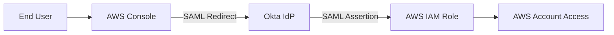

# Okta → AWS IAM Role Federation Lab (Workforce Model)

# 🔐 Okta → AWS SAML Federation Lab

## Overview

This project demonstrates federated authentication between **Okta (Identity Provider)** and **AWS** using **SAML 2.0**.

The lab implements secure Single Sign-On (SSO) into AWS by establishing trust between Okta and an AWS IAM role via SAML assertions.

This implementation reflects a common enterprise identity federation pattern used to centralize authentication while delegating authorization to AWS IAM.

---

## 🏗 Architecture

---

## 🔁 Authentication Flow

1. User attempts to access AWS.
2. AWS redirects user to Okta (SAML request).
3. Okta authenticates the user.
4. Okta sends SAML assertion to AWS.
5. AWS assumes configured IAM role.
6. User gains access to AWS console.

---

## ⚙️ Configuration Steps

### 1️⃣ Okta Application Setup

- Added AWS SAML application in Okta.
- Configured ACS URL and Audience URI from AWS.
- Mapped NameID to email.
- Assigned users/groups to application.

📸 Screenshot:

---

### 2️⃣ AWS IAM Role Trust Policy

- Created IAM role for SAML federation.
- Configured trust relationship with Okta as SAML provider.
- Allowed `sts:AssumeRoleWithSAML`.

📸 Screenshot:

---

### 3️⃣ Successful SSO Login

User successfully authenticated via Okta and assumed AWS IAM role.

📸 Screenshot:

---

### 4️⃣ CloudTrail Logging Validation

Verified SAML role assumption in AWS CloudTrail logs.

📸 Screenshot:

---

## 🧠 Identity Concepts Demonstrated

- SAML 2.0 federation
- IAM role trust relationships
- STS AssumeRoleWithSAML
- Centralized authentication via IdP
- Separation of authentication and authorization
- Federated access audit logging

---

## 🔒 Security Considerations

- No long-lived IAM user credentials
- Role-based access instead of direct user permissions
- Centralized identity enforcement via Okta
- Audit visibility through CloudTrail

---

## 🚀 Outcome

Successfully implemented:

- Federated SSO from Okta to AWS
- Secure IAM role trust configuration
- Verified role assumption through audit logs
- Centralized authentication model

This lab demonstrates foundational cloud identity federation used in enterprise AWS environments.

---

## Full Case Study

Detailed walkthrough available here:  
[Okta → AWS IAM Role Federation Case Study](https://reliable-bougon-dc6.notion.site/309bb6ca1876801ca7f8d136c34c8e4b)

---

